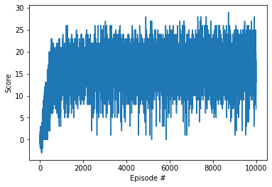

## Report

### Learning Algorithm
#### DQN
We use Deep Q networks to solve this problem. DQN learns by predicting a Q value that indicates the quality of the actions for a particular state. Using this trained function we can then maximize for Q as a method of selecting the best action.

The below shows the DQN function used for this project. This function returns a list of scores for each episode and continues until either the max number of episodes have been reached or we achieve all the potential scores in solve_score_list.

```
def dqn(n_episodes=2000, max_t=100000, eps_start=1.0, eps_end=0.01, eps_decay=0.995):
    """Deep Q-Learning.
    
    Params
    ======
        n_episodes (int): maximum number of training episodes
        max_t (int): maximum number of timesteps per episode
        eps_start (float): starting value of epsilon, for epsilon-greedy action selection
        eps_end (float): minimum value of epsilon
        eps_decay (float): multiplicative factor (per episode) for decreasing epsilon
    """
    scores = []                        # list containing scores from each episode
    scores_window = deque(maxlen=100)  # last 100 scores
    eps = eps_start                    # initialize epsilon
    solve_score_list=[10.0, 15.0, 20.0, 25.0, 30.0]
    solve_score_idx=0
    for i_episode in range(1, n_episodes+1):
        
        start = time.time()
        env_info = env.reset(train_mode=True)[brain_name]
        state = env_info.vector_observations[0] 
        score = 0
        for t in range(max_t):
            action = agent.act(state, eps)
            env_info = env.step(action)[brain_name]
            next_state = env_info.vector_observations[0]
            reward = env_info.rewards[0]
            done = env_info.local_done[0]
            agent.step(state, action, reward, next_state, done)
            score += reward
            state = next_state
            if done:
                break 
        scores_window.append(score)       # save most recent score
        scores.append(score)              # save most recent score
        eps = max(eps_end, eps_decay*eps) # decrease epsilon
        end = time.time() 
        print('\rEpisode {}\tAverage Score: {:.2f} \t {:.2f} Seconds Elapsed'.format(i_episode, np.mean(scores_window), end-start), end="")
        if i_episode % 100 == 0:
            print('\rEpisode {}\tAverage Score: {:.2f}'.format(i_episode, np.mean(scores_window)))
        if np.mean(scores_window)>=solve_score_list[solve_score_idx]:
            print('\nEnvironment solved in {:d} episodes!\tAverage Score: {:.2f}'.format(i_episode-100, np.mean(scores_window)))
            torch.save(agent.qnetwork_local.state_dict(), 'checkpoint-'+str(i_episode)+'.pth')
            if solve_score_idx<len(solve_score_list)-1:
                solve_score_idx=+1
            else:
                break
         
            
    return scores
```
#### Selected Hyperparameters
- EPS_DECAY: 0.995
- BUFFER_SIZE: 1e5
- BATCH_SIZE: 64
- GAMMA: 0.99
- TAU: 1e-3
- LR: 5e-5
- UPDATE_EVERY: 4

#### Additional Updates
For our implementation of DQN we also added an experience replay buffer. This allows to buffer experiences and sample them out of sequence. This can help us learn multiple times from experiences. For example, during early training we may not experience reaching the target often. With the buffer we can replay that experience multiple times to converge to a better solution faster.

We also use Fixed Q values. The issue this solves is the dependency of our temporal difference target on the weights of a network that we are trying to learn. The dependency makes our TD target move around during training. Fixed Q values uses a fixed network during the learning step.


#### Model
DQN uses a Q function to approximate the quality of a particular action for a given state. We model the Q function using a neural network. The network is composed of three Linear layers with an input dimension of 37, 128 first hidden layer, 64 second hidden layer and output dimension of 4. The activation function RELU was used for each layer. We used the Adam optimizer to train the network.


#### Results
After training the network we report the below points showing different points where the model first reaches reward milestones.
After 437 episodes we reach an average score of 10.01.
After 780 episodes we reach an average score of 15.03.
After 9802 episodes we reach an average score of 17.77.

At episode 880 the network has reached an average score of over 15.03 for the last 100 episodes and thereby indicating a stable solution.



### Future Work
Additional updates to the DQN implementation include Double DQN, Prioritized experience replay and Dueling DQN. 

Double DQN is a method that attempts to avoid the overestimation problem by having two function approximators to avoid overestimation that may come by chance with only a single network.
Prioritized Experience Replay is a nonuniform sampling method to identify samples that that can have larger learning characterized by a TD error of the sample.
Dueling DQNs uses estimates of both a state value function and advantage function for each action to obtain a Q value.
